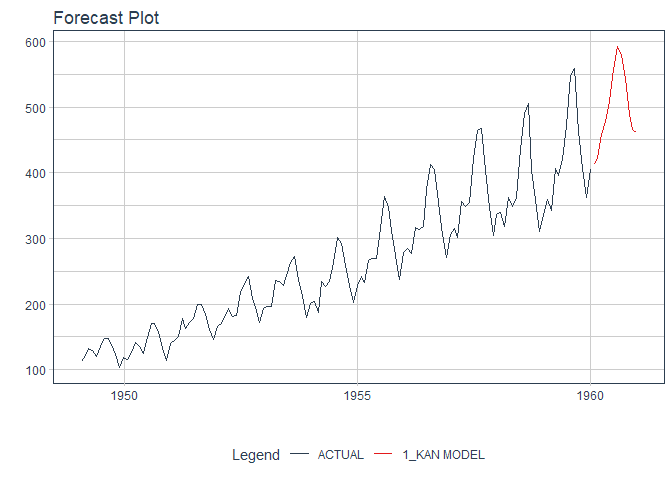

<!-- README.md is generated from README.Rmd. Please edit that file -->

# kantime

<!-- badges: start -->
<!-- badges: end -->

{kantime} is a minimal wrapper for Time Series Kolmogorov Arnold
Networks in R. By binding nixtla’s {neuralforecast} engine, KAN, from
Python to use in R. Additional steps were made to bridged to
{modeltime}, hence the name {kantime}!

## Installation

You can install the development version of kantime like so:

``` r
devtools::install_github("frankiethull/kantime")
```

## Example

This is a basic example showing the barebones {reticulate} Python
wrappers. These are the core bindings before registering can configuring
to {parsnip} and then bridging to {modeltime}.

#### setup {kantime}

kantime requires python and neuralforecast.

``` r
# load the R library -------------------
library(kantime)

# setup Python environment -------------
# 1) create a virtual env   ~ 
# kantime::create_neuralforecast_env()

# 2) use the virtual env    ~
kantime::use_neuralforecast_env()

# 3) install neuralforecast ~  
#kantime::install_neuralforecast()
```

##### example data for testing the library:

``` r
## data comes from sister repo

air_passengers_df <- readr::read_csv("https://raw.githubusercontent.com/frankiethull/nixtla-r-tutorial/refs/heads/main/airpassengersDF.csv", show_col_types = FALSE)

Sys.sleep(1)

train_df <- air_passengers_df |> dplyr::slice(1:132)
test_df  <- air_passengers_df |> dplyr::anti_join(train_df)
#> Joining with `by = join_by(unique_id, ds, y)`
```

#### barebone internals, no xregs, with conformal prediction

note that nixtla’s design requires a *unique_id* for each unique time
series, *ds* for the time column, and *y* for the outcome variable. The
internals work as minimal python wrappers to **fit** and **predict** on
a time series data like so:

``` r

# kan specs --
kan_model_specs <- kantime:::kan_spec(h = 12L)

# fit
kan_model_fit   <- kantime:::conformal_fit(model_spec = kan_model_specs, df = train_df)

# predict
conf_kan_preds  <- kantime:::conformal_predict(
                                     model_spec = kan_model_specs, 
                                     model_fit = kan_model_fit,
                                     level = 90L)
```

These internals are built thanks to {reticulate} and of using Nixtla’s
{neuralforecast} via R. While the idea works ok, the results and
workflow can be clunky for R, especially when building for many unique
IDs (many models for different time series loses pandas row IDs).
Additionally, handling parallel processes in R via {reticulate} for cv,
tuning and training in Python requires additional robustness.

{kantime} is super experimental in it’s design. Which is also why this
is not a full {neuralforecast} binding. This binding in particular is
going to leverage the root KAN model, a few helper utils, then bind the
base KAN model to {parsnip} and bridge to {modeltime}. This loses pieces
of the underlying Nixtla functionality but replacing with {tidymodels} &
{modeltime} functionality.

#### {neuralforecast}’s kan with a {modeltime} bridge

given our underlying internals, we can bind these functions to
{modeltime} which is similar to registering a parsnip model but requires
an additional bridge. The bridge implementation is shown below, but we
have to add predict methods and there’s quite a bit of underlying work
that makes it fully functioning.

``` r
kan_bridge <- kantime:::kan_bridge_fit_impl(
  x = train_df |> dplyr::select(-y),
  y = train_df |> dplyr::pull(y),
  h = 12L,
  input_size = 24L,
  max_steps = 10L,
  freq = "ME"
)

kan_bridge |> predict()
```

#### {kantime} workflow within {modeltime}

Remembering that once the model has been bridged to {modeltime}, we lose
some of the underlying nixtla utilities, but get access to tidymodels +
modeltime utilities in R. What’s this mean? We can now use this KAN
binding with tidymodels tools like `initial_time_split` and we can use
leverage `modeltime`’s toolkit to further calibrate & validate KAN
models. In fact, we went through these additional bridging steps to have
a full suite of backtesting, ensembling, calibrating, and scoring tools
that will be very familiar if already using {modeltime} and/or
{tidymodels}.

``` r
library(parsnip)
library(modeltime)

# time split
splits   <- rsample::initial_time_split(air_passengers_df, prop = .92)
training <- rsample::training(splits)
testing  <- rsample::testing(splits)

# kantime fit
kantime_fit <- kan(h = 12L,
                   input_size = 24L,
                   max_steps = 10L,
                   freq = "ME") |>
                set_engine("kan") |>
               fit(y ~ ds + unique_id, data = training)
#> Sanity Checking: |          | 0/? [00:00<?, ?it/s]Sanity Checking:   0%|          | 0/1 [00:00<?, ?it/s]Sanity Checking DataLoader 0:   0%|          | 0/1 [00:00<?, ?it/s]Sanity Checking DataLoader 0: 100%|██████████| 1/1 [00:00<?, ?it/s]                                                                   Training: |          | 0/? [00:00<?, ?it/s]Training:   0%|          | 0/1 [00:00<?, ?it/s]Epoch 0:   0%|          | 0/1 [00:00<?, ?it/s] Epoch 0: 100%|██████████| 1/1 [00:01<00:00,  0.95it/s]Epoch 0: 100%|██████████| 1/1 [00:01<00:00,  0.95it/s, v_num=102, train_loss_step=1.860]Epoch 0: 100%|██████████| 1/1 [00:01<00:00,  0.93it/s, v_num=102, train_loss_step=1.860, train_loss_epoch=1.860]Epoch 0:   0%|          | 0/1 [00:00<?, ?it/s, v_num=102, train_loss_step=1.860, train_loss_epoch=1.860]        Epoch 1:   0%|          | 0/1 [00:00<?, ?it/s, v_num=102, train_loss_step=1.860, train_loss_epoch=1.860]Epoch 1: 100%|██████████| 1/1 [00:00<00:00,  1.14it/s, v_num=102, train_loss_step=1.860, train_loss_epoch=1.860]Epoch 1: 100%|██████████| 1/1 [00:00<00:00,  1.14it/s, v_num=102, train_loss_step=1.790, train_loss_epoch=1.860]Epoch 1: 100%|██████████| 1/1 [00:00<00:00,  1.14it/s, v_num=102, train_loss_step=1.790, train_loss_epoch=1.790]Epoch 1:   0%|          | 0/1 [00:00<?, ?it/s, v_num=102, train_loss_step=1.790, train_loss_epoch=1.790]        Epoch 2:   0%|          | 0/1 [00:00<?, ?it/s, v_num=102, train_loss_step=1.790, train_loss_epoch=1.790]Epoch 2: 100%|██████████| 1/1 [00:00<00:00,  1.20it/s, v_num=102, train_loss_step=1.790, train_loss_epoch=1.790]Epoch 2: 100%|██████████| 1/1 [00:00<00:00,  1.20it/s, v_num=102, train_loss_step=1.730, train_loss_epoch=1.790]Epoch 2: 100%|██████████| 1/1 [00:00<00:00,  1.19it/s, v_num=102, train_loss_step=1.730, train_loss_epoch=1.730]Epoch 2:   0%|          | 0/1 [00:00<?, ?it/s, v_num=102, train_loss_step=1.730, train_loss_epoch=1.730]        Epoch 3:   0%|          | 0/1 [00:00<?, ?it/s, v_num=102, train_loss_step=1.730, train_loss_epoch=1.730]Epoch 3: 100%|██████████| 1/1 [00:00<00:00,  1.21it/s, v_num=102, train_loss_step=1.730, train_loss_epoch=1.730]Epoch 3: 100%|██████████| 1/1 [00:00<00:00,  1.21it/s, v_num=102, train_loss_step=1.680, train_loss_epoch=1.730]Epoch 3: 100%|██████████| 1/1 [00:00<00:00,  1.21it/s, v_num=102, train_loss_step=1.680, train_loss_epoch=1.680]Epoch 3:   0%|          | 0/1 [00:00<?, ?it/s, v_num=102, train_loss_step=1.680, train_loss_epoch=1.680]        Epoch 4:   0%|          | 0/1 [00:00<?, ?it/s, v_num=102, train_loss_step=1.680, train_loss_epoch=1.680]Epoch 4: 100%|██████████| 1/1 [00:00<00:00,  1.20it/s, v_num=102, train_loss_step=1.680, train_loss_epoch=1.680]Epoch 4: 100%|██████████| 1/1 [00:00<00:00,  1.20it/s, v_num=102, train_loss_step=1.640, train_loss_epoch=1.680]Epoch 4: 100%|██████████| 1/1 [00:00<00:00,  1.20it/s, v_num=102, train_loss_step=1.640, train_loss_epoch=1.640]Epoch 4:   0%|          | 0/1 [00:00<?, ?it/s, v_num=102, train_loss_step=1.640, train_loss_epoch=1.640]        Epoch 5:   0%|          | 0/1 [00:00<?, ?it/s, v_num=102, train_loss_step=1.640, train_loss_epoch=1.640]Epoch 5: 100%|██████████| 1/1 [00:00<00:00,  1.21it/s, v_num=102, train_loss_step=1.640, train_loss_epoch=1.640]Epoch 5: 100%|██████████| 1/1 [00:00<00:00,  1.21it/s, v_num=102, train_loss_step=1.560, train_loss_epoch=1.640]Epoch 5: 100%|██████████| 1/1 [00:00<00:00,  1.21it/s, v_num=102, train_loss_step=1.560, train_loss_epoch=1.560]Epoch 5:   0%|          | 0/1 [00:00<?, ?it/s, v_num=102, train_loss_step=1.560, train_loss_epoch=1.560]        Epoch 6:   0%|          | 0/1 [00:00<?, ?it/s, v_num=102, train_loss_step=1.560, train_loss_epoch=1.560]Epoch 6: 100%|██████████| 1/1 [00:00<00:00,  1.15it/s, v_num=102, train_loss_step=1.560, train_loss_epoch=1.560]Epoch 6: 100%|██████████| 1/1 [00:00<00:00,  1.13it/s, v_num=102, train_loss_step=1.490, train_loss_epoch=1.560]Epoch 6: 100%|██████████| 1/1 [00:00<00:00,  1.13it/s, v_num=102, train_loss_step=1.490, train_loss_epoch=1.490]Epoch 6:   0%|          | 0/1 [00:00<?, ?it/s, v_num=102, train_loss_step=1.490, train_loss_epoch=1.490]        Epoch 7:   0%|          | 0/1 [00:00<?, ?it/s, v_num=102, train_loss_step=1.490, train_loss_epoch=1.490]Epoch 7: 100%|██████████| 1/1 [00:00<00:00,  1.18it/s, v_num=102, train_loss_step=1.490, train_loss_epoch=1.490]Epoch 7: 100%|██████████| 1/1 [00:00<00:00,  1.18it/s, v_num=102, train_loss_step=1.450, train_loss_epoch=1.490]Epoch 7: 100%|██████████| 1/1 [00:00<00:00,  1.18it/s, v_num=102, train_loss_step=1.450, train_loss_epoch=1.450]Epoch 7:   0%|          | 0/1 [00:00<?, ?it/s, v_num=102, train_loss_step=1.450, train_loss_epoch=1.450]        Epoch 8:   0%|          | 0/1 [00:00<?, ?it/s, v_num=102, train_loss_step=1.450, train_loss_epoch=1.450]Epoch 8: 100%|██████████| 1/1 [00:00<00:00,  1.17it/s, v_num=102, train_loss_step=1.450, train_loss_epoch=1.450]Epoch 8: 100%|██████████| 1/1 [00:00<00:00,  1.17it/s, v_num=102, train_loss_step=1.400, train_loss_epoch=1.450]Epoch 8: 100%|██████████| 1/1 [00:00<00:00,  1.17it/s, v_num=102, train_loss_step=1.400, train_loss_epoch=1.400]Epoch 8:   0%|          | 0/1 [00:00<?, ?it/s, v_num=102, train_loss_step=1.400, train_loss_epoch=1.400]        Epoch 9:   0%|          | 0/1 [00:00<?, ?it/s, v_num=102, train_loss_step=1.400, train_loss_epoch=1.400]Epoch 9: 100%|██████████| 1/1 [00:00<00:00,  1.20it/s, v_num=102, train_loss_step=1.400, train_loss_epoch=1.400]Epoch 9: 100%|██████████| 1/1 [00:00<00:00,  1.20it/s, v_num=102, train_loss_step=1.310, train_loss_epoch=1.400]
#> Validation: |          | 0/? [00:00<?, ?it/s]
#> Validation:   0%|          | 0/1 [00:00<?, ?it/s]
#> Validation DataLoader 0:   0%|          | 0/1 [00:00<?, ?it/s]
#> Validation DataLoader 0: 100%|██████████| 1/1 [00:00<?, ?it/s]
#>                                                               Epoch 9: 100%|██████████| 1/1 [00:00<00:00,  1.20it/s, v_num=102, train_loss_step=1.310, train_loss_epoch=1.400]Epoch 9: 100%|██████████| 1/1 [00:00<00:00,  1.20it/s, v_num=102, train_loss_step=1.310, train_loss_epoch=1.310]Epoch 9: 100%|██████████| 1/1 [00:00<00:00,  1.18it/s, v_num=102, train_loss_step=1.310, train_loss_epoch=1.310]
#> Predicting: |          | 0/? [00:00<?, ?it/s]Predicting:   0%|          | 0/1 [00:00<?, ?it/s]Predicting DataLoader 0:   0%|          | 0/1 [00:00<?, ?it/s]Predicting DataLoader 0: 100%|██████████| 1/1 [00:00<?, ?it/s]Predicting DataLoader 0: 100%|██████████| 1/1 [00:00<?, ?it/s]
#> Sanity Checking: |          | 0/? [00:00<?, ?it/s]Sanity Checking:   0%|          | 0/1 [00:00<?, ?it/s]Sanity Checking DataLoader 0:   0%|          | 0/1 [00:00<?, ?it/s]Sanity Checking DataLoader 0: 100%|██████████| 1/1 [00:00<?, ?it/s]                                                                   Training: |          | 0/? [00:00<?, ?it/s]Training:   0%|          | 0/1 [00:00<?, ?it/s]Epoch 0:   0%|          | 0/1 [00:00<?, ?it/s] Epoch 0: 100%|██████████| 1/1 [00:00<00:00,  1.03it/s]Epoch 0: 100%|██████████| 1/1 [00:00<00:00,  1.03it/s, v_num=104, train_loss_step=1.210]Epoch 0: 100%|██████████| 1/1 [00:00<00:00,  1.03it/s, v_num=104, train_loss_step=1.210, train_loss_epoch=1.210]Epoch 0:   0%|          | 0/1 [00:00<?, ?it/s, v_num=104, train_loss_step=1.210, train_loss_epoch=1.210]        Epoch 1:   0%|          | 0/1 [00:00<?, ?it/s, v_num=104, train_loss_step=1.210, train_loss_epoch=1.210]Epoch 1: 100%|██████████| 1/1 [00:00<00:00,  1.20it/s, v_num=104, train_loss_step=1.210, train_loss_epoch=1.210]Epoch 1: 100%|██████████| 1/1 [00:00<00:00,  1.20it/s, v_num=104, train_loss_step=1.150, train_loss_epoch=1.210]Epoch 1: 100%|██████████| 1/1 [00:00<00:00,  1.20it/s, v_num=104, train_loss_step=1.150, train_loss_epoch=1.150]Epoch 1:   0%|          | 0/1 [00:00<?, ?it/s, v_num=104, train_loss_step=1.150, train_loss_epoch=1.150]        Epoch 2:   0%|          | 0/1 [00:00<?, ?it/s, v_num=104, train_loss_step=1.150, train_loss_epoch=1.150]Epoch 2: 100%|██████████| 1/1 [00:00<00:00,  1.19it/s, v_num=104, train_loss_step=1.150, train_loss_epoch=1.150]Epoch 2: 100%|██████████| 1/1 [00:00<00:00,  1.19it/s, v_num=104, train_loss_step=1.080, train_loss_epoch=1.150]Epoch 2: 100%|██████████| 1/1 [00:00<00:00,  1.19it/s, v_num=104, train_loss_step=1.080, train_loss_epoch=1.080]Epoch 2:   0%|          | 0/1 [00:00<?, ?it/s, v_num=104, train_loss_step=1.080, train_loss_epoch=1.080]        Epoch 3:   0%|          | 0/1 [00:00<?, ?it/s, v_num=104, train_loss_step=1.080, train_loss_epoch=1.080]Epoch 3: 100%|██████████| 1/1 [00:00<00:00,  1.16it/s, v_num=104, train_loss_step=1.080, train_loss_epoch=1.080]Epoch 3: 100%|██████████| 1/1 [00:00<00:00,  1.16it/s, v_num=104, train_loss_step=1.020, train_loss_epoch=1.080]Epoch 3: 100%|██████████| 1/1 [00:00<00:00,  1.16it/s, v_num=104, train_loss_step=1.020, train_loss_epoch=1.020]Epoch 3:   0%|          | 0/1 [00:00<?, ?it/s, v_num=104, train_loss_step=1.020, train_loss_epoch=1.020]        Epoch 4:   0%|          | 0/1 [00:00<?, ?it/s, v_num=104, train_loss_step=1.020, train_loss_epoch=1.020]Epoch 4: 100%|██████████| 1/1 [00:00<00:00,  1.12it/s, v_num=104, train_loss_step=1.020, train_loss_epoch=1.020]Epoch 4: 100%|██████████| 1/1 [00:00<00:00,  1.11it/s, v_num=104, train_loss_step=0.979, train_loss_epoch=1.020]Epoch 4: 100%|██████████| 1/1 [00:00<00:00,  1.11it/s, v_num=104, train_loss_step=0.979, train_loss_epoch=0.979]Epoch 4:   0%|          | 0/1 [00:00<?, ?it/s, v_num=104, train_loss_step=0.979, train_loss_epoch=0.979]        Epoch 5:   0%|          | 0/1 [00:00<?, ?it/s, v_num=104, train_loss_step=0.979, train_loss_epoch=0.979]Epoch 5: 100%|██████████| 1/1 [00:00<00:00,  1.19it/s, v_num=104, train_loss_step=0.979, train_loss_epoch=0.979]Epoch 5: 100%|██████████| 1/1 [00:00<00:00,  1.19it/s, v_num=104, train_loss_step=0.909, train_loss_epoch=0.979]Epoch 5: 100%|██████████| 1/1 [00:00<00:00,  1.19it/s, v_num=104, train_loss_step=0.909, train_loss_epoch=0.909]Epoch 5:   0%|          | 0/1 [00:00<?, ?it/s, v_num=104, train_loss_step=0.909, train_loss_epoch=0.909]        Epoch 6:   0%|          | 0/1 [00:00<?, ?it/s, v_num=104, train_loss_step=0.909, train_loss_epoch=0.909]Epoch 6: 100%|██████████| 1/1 [00:00<00:00,  1.21it/s, v_num=104, train_loss_step=0.909, train_loss_epoch=0.909]Epoch 6: 100%|██████████| 1/1 [00:00<00:00,  1.21it/s, v_num=104, train_loss_step=0.859, train_loss_epoch=0.909]Epoch 6: 100%|██████████| 1/1 [00:00<00:00,  1.21it/s, v_num=104, train_loss_step=0.859, train_loss_epoch=0.859]Epoch 6:   0%|          | 0/1 [00:00<?, ?it/s, v_num=104, train_loss_step=0.859, train_loss_epoch=0.859]        Epoch 7:   0%|          | 0/1 [00:00<?, ?it/s, v_num=104, train_loss_step=0.859, train_loss_epoch=0.859]Epoch 7: 100%|██████████| 1/1 [00:00<00:00,  1.20it/s, v_num=104, train_loss_step=0.859, train_loss_epoch=0.859]Epoch 7: 100%|██████████| 1/1 [00:00<00:00,  1.20it/s, v_num=104, train_loss_step=0.803, train_loss_epoch=0.859]Epoch 7: 100%|██████████| 1/1 [00:00<00:00,  1.20it/s, v_num=104, train_loss_step=0.803, train_loss_epoch=0.803]Epoch 7:   0%|          | 0/1 [00:00<?, ?it/s, v_num=104, train_loss_step=0.803, train_loss_epoch=0.803]        Epoch 8:   0%|          | 0/1 [00:00<?, ?it/s, v_num=104, train_loss_step=0.803, train_loss_epoch=0.803]Epoch 8: 100%|██████████| 1/1 [00:00<00:00,  1.12it/s, v_num=104, train_loss_step=0.803, train_loss_epoch=0.803]Epoch 8: 100%|██████████| 1/1 [00:00<00:00,  1.12it/s, v_num=104, train_loss_step=0.767, train_loss_epoch=0.803]Epoch 8: 100%|██████████| 1/1 [00:00<00:00,  1.12it/s, v_num=104, train_loss_step=0.767, train_loss_epoch=0.767]Epoch 8:   0%|          | 0/1 [00:00<?, ?it/s, v_num=104, train_loss_step=0.767, train_loss_epoch=0.767]        Epoch 9:   0%|          | 0/1 [00:00<?, ?it/s, v_num=104, train_loss_step=0.767, train_loss_epoch=0.767]Epoch 9: 100%|██████████| 1/1 [00:00<00:00,  1.19it/s, v_num=104, train_loss_step=0.767, train_loss_epoch=0.767]Epoch 9: 100%|██████████| 1/1 [00:00<00:00,  1.19it/s, v_num=104, train_loss_step=0.731, train_loss_epoch=0.767]
#> Validation: |          | 0/? [00:00<?, ?it/s]
#> Validation:   0%|          | 0/1 [00:00<?, ?it/s]
#> Validation DataLoader 0:   0%|          | 0/1 [00:00<?, ?it/s]
#> Validation DataLoader 0: 100%|██████████| 1/1 [00:00<?, ?it/s]
#>                                                               Epoch 9: 100%|██████████| 1/1 [00:00<00:00,  1.18it/s, v_num=104, train_loss_step=0.731, train_loss_epoch=0.767]Epoch 9: 100%|██████████| 1/1 [00:00<00:00,  1.18it/s, v_num=104, train_loss_step=0.731, train_loss_epoch=0.731]Epoch 9: 100%|██████████| 1/1 [00:00<00:00,  1.18it/s, v_num=104, train_loss_step=0.731, train_loss_epoch=0.731]

# kantime predict
kan_point_predictions <- 
kantime_fit |>
 modeltime_table() |>
  modeltime_forecast(actual_data = training, new_data = testing) 
#> Predicting: |          | 0/? [00:00<?, ?it/s]Predicting:   0%|          | 0/1 [00:00<?, ?it/s]Predicting DataLoader 0:   0%|          | 0/1 [00:00<?, ?it/s]Predicting DataLoader 0: 100%|██████████| 1/1 [00:00<00:00, 50.65it/s]Predicting DataLoader 0: 100%|██████████| 1/1 [00:00<00:00, 50.65it/s]

kan_point_predictions |>
  plot_modeltime_forecast(.conf_interval_show = FALSE, .interactive = FALSE)
```



##### To Do’s

1)  *KAN:* KAN is still univariate without xreg support. (I wasn’t sure
    if this would work so started with only bridging a few KAN
    parameters.)  
2)  *KAN* could use more informative info when printed.  
3)  predict(…*type = “prob”*), by design, kantime wraps the conformal
    method of nixtla so prediction intervals could be mapped to
    predict() calls, by-passing the need to calibrate in R, depending on
    the situation.
4)  add in sample predictions to the modeltime bridge  
5)  *UX:* handle nixtla requirements, i.e. **y, ds and unique_id**,
    could be tidied within internals  
6)  *UI:* pandas/reticulate arg types! internals should handle numeric
    inputs as integers and pass to python for R programmer.  
7)  handle warnings like `NIXTLA_ID_AS_COL` and  
8)  `.nested.col = purrr::map2(...)` in final `modeltime_forecast`
